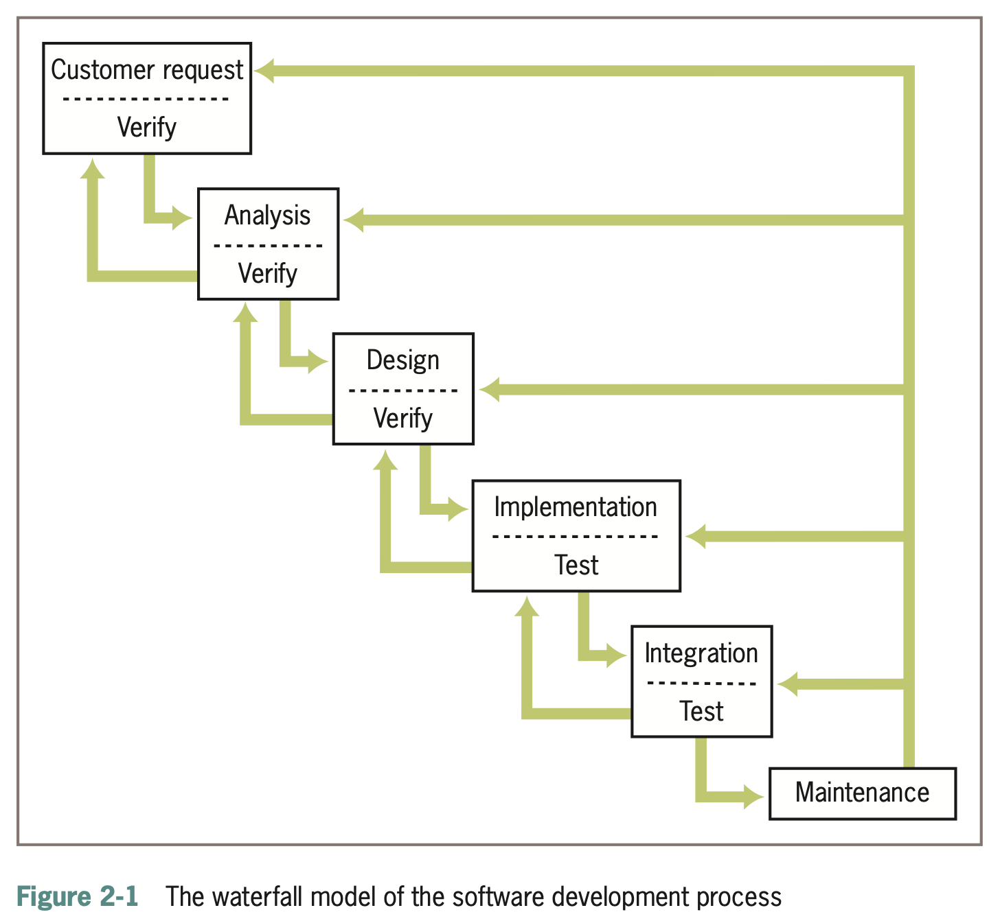
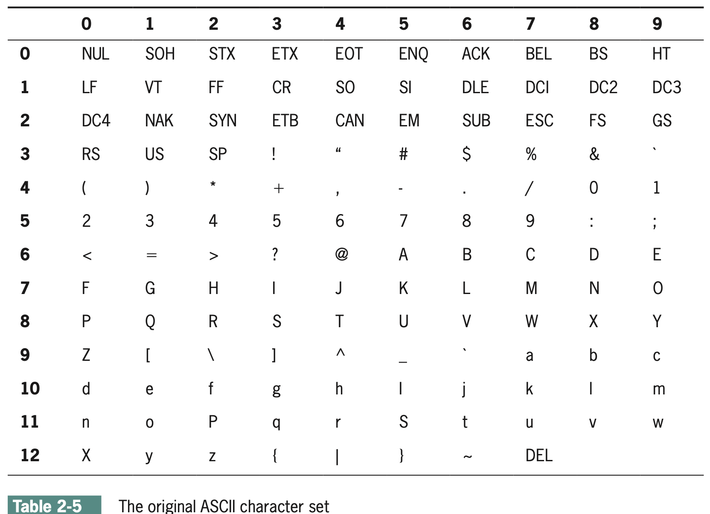

## Contents 

- The idea of coding and programming
  - Waterfall Method
  - Pseudo-code
- Strings, Assignments, and Comments
  - String Literals
  - Assignment Operator and Variables
  - Comments and Doc-strings
- Numeric and Character Data types
  - Integers and Floating Points
  - ASCII Table
  
---

- Expressions
  - Arithmetic Expressions
  - Mixed-Mode Arithmetic and Type Conversions
- Functions and Modules
  - Calling Functions: Arguments and Return Values
  - `help` function
  - `math` module
- General Program Structure

# Coding and Programming

## Coding and Programming (Part 1 of 2)

- Programming is just more than lines of code. Computer scientists refer to the process of planning and organizing a program as **software development**. There are several approaches to software development. One version is known as the **waterfall model**. 

#### Waterfall method
- **Customer Request**
- **Analysis**
- **Design**
- **Implementation**
- **Integration**
- **Maintenance**

## Coding and Programming (Part 2 of 2)

{width="800px" height="600px"}

- Modern software development is usually **incremental** and **iterative**. This means that analysis and design may produce a rough draft, skeletal version, or **prototype** of a system for coding, and then back up to earlier phases to fill in more details after some testing. 

# Case Study: Income Tax Calculator

## Case Study: Income Tax Calculator (1 out of 4)

**Request**: The customer wants us to create a program that calculates a person’s income tax.

**Analysis**: To create the program, the programmer first needs to understand the problem and the rules involved. In this case, we need to know the basic tax laws that the program will use. For this example, we will use the following tax laws.

* All taxpayers are charged a flat tax rate of 20%
* All taxpayers are allowed a $10000 standard deduction
* For each dependent, a taxpayer is allowed an additional $3000 deduction
* Gross income must be entered to the nearest penny
* The income tax is expressed as a decimal number

## Case Study: Income Tax Calculator (2 out of 4)

**Design**: In the analysis phase, we figure out what the program needs to do. In the design phase, we figure out how the program is going to do it. One way of showing how a program works is by using pseudocode.

For this program, the pseudocode would be:

* Input the gross income and number of dependents
* Compute the taxable income using the formula
* Taxable income = gross income - 10000 - (3000 * number of dependents)
* Compute the income tax using the formula
* Tax = taxable income * 0.20
* Print the tax

There are no specific rules for writing pseudocode. The main goal is to explain the important parts of the program in a clear and simple way. In this case, the pseudocode is similar to Python code, which makes it easier to turn the pseudocode into the actual program.

## Case Study: Income Tax Calculator (3 out of 4)

**Implementation**

After creating the pseudocode, the next step is to write the actual Python program. An experienced programmer would probably find this program fairly simple, but for a beginner, writing the code can be more difficult. The code below follows the steps from the pseudocode and calculates the income tax based on the person's gross income and number of dependents.

```python
"""
 Program: taxform.py
 Author: Ken Lambert
 Compute a person’s income tax.
 1. Significant constants
         tax rate
         standard deduction
         deduction per dependent
 2. The inputs are
         gross income
         number of dependents
 3. Computations:
         taxable income = gross income - the standard
               deduction - a deduction for each dependent
         income tax = is a fixed percentage of the taxable income
 4. The outputs are the income tax
"""

# Initialize the constants
TAX_RATE = 0.20
STANDARD_DEDUCTION = 10000.0
DEPENDENT_DEDUCTION = 3000.0
 
# Request the inputs
grossIncome = float(input("Enter the gross income: "))
numDependents = int(input("Enter the number of dependents: "))

# Compute the income tax
taxableIncome = grossIncome - STANDARD_DEDUCTION - \
            DEPENDENT_DEDUCTION * numDependents
incomeTax = taxableIncome * TAX_RATE
 
# Display the income tax
print("The income tax is $" + str(incomeTax))
```

## Case Study: Income Tax Calculator (4 out of 4)

**Testing**

To test the program, we can enter different gross incomes and numbers of dependents to make sure the tax is being calculated correctly.

For example:

* Gross income: $50000
* Number of dependents: 2
* Standard deduction: $10000
* Dependent deduction: $6000
* Taxable income: $34000
* Income tax: $6800

The program should display:

**The income tax is $6800.0**

Testing different values helps make sure the program is working correctly and following the given tax rules.

# Strings, assignment, and Comments

## Strings, assignment, and Comments

* Text processing is by far the most common application of computing
* E-mail, text messaging, Web pages, and word processing all rely on and
manipulate data consisting of strings of characters

## Date Types (1 out of 2)

* A **data type** consists of a set of values and a set of operations that can be
performed on those values
* A **literal** is the way a value of a data type looks to a programmer
* **int** and **float** are numeric data types
  * They represent numbers
  
## Date Types (2 out of 2)

| Type of Data | Python Type Name | Example Literals |
|--------------|------------------|------------------| 
| Integers     | `int`            | `-1, 0, 1, 2`    |
| Real Numbers | `float`          | `-0.55, .33333, 3.14, 6.0` |
| Character Strings | `str`      | `"Hi", "'", 'A', "66" `|

## String Literals (1 out of 2)

* In Python, a string literal is a sequence of characters enclosed in single or double quotation marks
* `''` and `""` represent the empty string
* Double-quoted strings are handy for composing strings that contain single
quotation marks or apostrophes:

```{python}
print("I'm using a single quote in this string!")
```

* Use `'''` and `"""` for multi-line paragraphs
```{python}
print("""This very long sentence extends
all the way to the next line.""")
```

## String Literals (2 out of 2)

Try it yourself!

TASK: 

Print the following format:

```
My name is [First name, last name]
Today is [Today's Date]
My favorite color is [Your Favorite Color]
```

First with multiple `print()` statements. Then try doing 1 `print()` statement.

```{pyodide-python}
# Enter your code below this comment


```


## Escape Sequences

* The newline character `\n` is called an **escape sequence**

| Escape Sequence | Meaning |
|-------|-------|
| `\b` | Backspace |
| `\n` | Newline |
| `\t` | Horizontal Tab |
| `\\` | The \ character |
| `\'` | Single quotation mark |
| `\"` | Double quotation mark | 

## String concatenation (1 out of 2)

* You can join two or more strings to form a new string using the concatenation operator `+`

```{python}
print("Hi " + "there," + " Ken!")
```

* The * operator allows you to build a string by repeating another string a given number of times
```{python}
print("." * 10 + "Python!")
```

## String concatenation (2 out of 2)

Try it yourself!

TASK:

Please print the following string:

`That joke is good hahahahaha`

Using **at least** 1 concatenation operators (+) and 1 repeating operator (*)

```{pyodide-python}
# Write your code below this comment


```

## Variables and the Assignment Statement (1 out of 3)

* A variable associates a name with a value
  * Makes it easy to remember and use later in program

* Variable naming rules:
  * Reserved words cannot be used as variable names
    - Examples: `if`, `def`, and `import`
 
  * Name must begin with a letter or _
  * Name can contain any number of letters, digits, or _
  * Names are case sensitive
    - Example: `WEIGHT` is different from `weight`
    
* Tip: begin each word in the variable name with an uppercase, except the first one
  (Example: interestRate)

##  Variables and the Assignment Statement (2 out of 3)

* Programmers use all uppercase letters for symbolic constants (contain values
that the program never changes)
  * Examples: `TAX_RATE` and `STANDARD_DEDUCTION`

* Variables receive initial values and can be reset to new values with an
assignment statement 

[variable name] = [expression]

* Subsequent uses of the variable name in expressions are known as variable
references

Example:
```{python}
firstName = "Mark Ira"
lastName = "Galang"
fullName = firstName + " " + lastName
print(fullName)
```

* Variables serves two purposes:
  * Help the programmer keep track of data that change over time
  * Allow the programmer to refer to a complex piece of information with a simple name (called abstraction)
  
## Variables and the Assignment Statement (3 out of 3)

Now its your turn!

TASK: 

Create the following variable names and print the information as the following:
`university`, `firstName`, `lastName`, `major`

```
My name is [firstName] [lastName] and I am from [university] majoring in [major].
```

```{pyodide-python}
# Enter the code here


```

## Program Comments and Doc strings (1 out of 2)

* Program comments
  * A piece of program text that the computer ignores but that provides useful documentation to programmers
  
* Doc string
  * A multi-line string of the form

Example:
```python
"""
Program: circle.py
Author: Ken Lambert
Last date modified: 10/10/17
The purpose of this program is to compute the area of a circle. The input is an integer or
floating-point number representing the radius of the circle. The output is a floating-point
number labeled as
"""
```

* End-of-line comments
  * Begin with the # symbol and extend to the end of a line
  *  Might explain the purpose of a variable or the strategy used by a piece of code

Example:
```python
RATE = 0.85 # Conversion rate for Canadian to US dollars
```

## Program Comments and Doc Strings (2 out of 2)

* Tips related to comments and doc strings:
  * Begin a program with a statement of purpose and other information helpful to programmers
  * Accompany a variable definition with a comment that explains the variable’s purpose
  * Precede major segments of code with brief comments that explain their purpose
  * Include comments to explain the workings of complex or tricky sections of code
  
TASK: 

Write a single or multi-lined comment about what is happening below:
```{pyodide-python}
# 
print("According to all known laws of avaiation, there is no way that a bee should be able to fly.")
```

# Numeric Data Types and Character Sets

## Integers

* In real life, the range of **Integers** is infinite 

* A computer’s memory places a limit on the magnitude of the largest positive and negative integers
  * Python's **int** typical range (for 64 bit):
  $-2^{63} \text{ to } 2^{63} - 1$
  
* Integer literals are written without commas

Example: 
```python
anInteger = 15
myAge = 23
```

## Float-Point Numbers (1 out of 2)

* Real numbers have **infinite precision** meaning the digits of a fractional part can continue forever
* Python uses floating-point numbers to represent real numbers
* Python's float typical range:
$-10^{308} \text{ to } 10^{308}$
* Typical precision: 16 digits

## Float-Point Numbers (2 out of 2)

A floating-point number can be written using either ordinary decimal notation or scientific notation

|Decimal Notation|Scientific Notation|Meaning|
|----------|----------|---------|
|3.78| 3.78e0 |$3.78 \times 10^0$|
|37.8| 3.78e1 |$3.78 \times 10^1$|
|3780.0| 3.78e3 |$3.78 \times 10^3$|
|0.378| 3.78e0$^{-1}$ |$3.78 \times 10^{-1}$|
|0.00378| 3.78e-3 |$3.78 \times 10^{-3}$|

## Character Sets

* In Python, character literals look just like string literals and are of the string type
  * They belong to several different **character sets**, among them the **ASCII** set and the **Unicode** set
* ASCII character set maps to a set of integers
* ord and chr functions convert characters to and from ASCII


Example:
```{python}
print("ASCII for a: " + str(ord("a")))
print("ASCII for A: " + str(ord("a")))
print("Character for 67: " + str(chr(67)))
```

{width="800px" height="600px"}

# Expressions

## Arithmetic Expressions (1 out of 3)

* **Expressions** provide easy way to perform operations on data values to produce other values
* When entered at Python shell prompt:
  * an expression’s operands are evaluated
  * its operator is then applied to these values to compute the value of the expression

* An **arithmetic expression** consists of operands and operators combined in a manner that is already familiar to you from learning algebra

| Operator | Meaning | Syntax | 
|----------|---------|--------|
| - | Negation | -a |
| ** | Exponentiation | a ** b |
| * | Multiplication | a * b |
| / | Division | a / b |
| // | Quotient | a // b | 
| % | Remainder or Modulus | a % b |
| + | Addition | a + b |
| - | Subtraction | a - b |

## Arithmetic Expressions (2 out of 3)

* **Precedence rules**:
  * ** has the highest precedence and is evaluated first
  * *, /, and % are evaluated before + and - 
  * + and - are evaluated before the =
  * With two exceptions, operations of equal precedence are **left associative**, so they are evaluated from left to right
    * ** and = are **right associative**
  * You can use () to change the order of evaluation
  
For multi-line expressions, use \
```{python}
operation = 3 + 4 * \
2 ** 5
print(operation)
```

## Arithmetic Expression (3 out of 3)

Now its your turn!

TASK:

Write the following expression in python and see the result:
$$
\dfrac{5(2.2)^3}{8}
$$

```{pyodide-python}
# Enter your code below this comment


```


## Mixed-Mode Arithmetic and Type Conversions (1 out of 3)

* Mixed-mode arithmetic involves integers and floating-point numbers:

```{python}
print(3.14 * 3 ** 2)
```

* You must use a type conversion function when working with **input** of numbers
  * It is a function with the same name as the data type to which it converts
* Input function returns a string as its value
  * You must use the int or float function to convert the string to a number before performing arithmetic

| Conversion Function | Example Use | Value Returned |
|---------------------|-------------|----------------|
|int(&lt; a number or string &gt;) | `int(3.77)` | 3 |
| | `int("33")` | 33 |
|float(&lt; a number or string &gt;) | `float(22)` | 22.0 |
| str(&lt; a number &gt;) | `str(6.3)` | "6.3" | 

Note that the int function converts a float to an int by **truncation**, not by rounding

```{python}
print(int(6.75))
```

```{python}
print(round(6.75))
```

## Mixed-Mode Arithmetic and Type Conversions (2 out of 3)

* Type conversion also occurs in the construction of strings from numbers and other strings

```{python}
profit = 1000.55
print("$" + profit)
```

* Python is a strongly typed programming language, so everything must be the same or similar type
* We need to convert the number to a string using the `str()`
```{python}
print("$" + str(profit))
```

## Mixed-Mode Arithmetic and Type Conversions (3 out of 3)

Now its your turn!

TASK:
Using the age variable, enter your age, make a new variable `age_in_five` where you use the age variable and then add 5 into it, then print a message saying what your age will e in 5 years using the age variable!

```{pyodide-python}
# Enter your code below
age = 


```

# Using Functions and Modules

## Calling Functions: Arguments and Return Values

* A **function** is chunk of code that can be called by name to perform a task
* Functions often require **arguments** or **parameters**
  * Arguments may be optional or required
* When function completes its task, it may **return a value** back to the part of the program that called it
* To learn how to use a function’s arguments, use the help function:
```{python}
help(round)
```

## The math module (1 out of 2)
* Functions and other resources are coded in components called **modules**
* Functions like **abs** and **round** from the _ builtin _ module are always available to use
* The **math** module includes functions that perform basic mathematical operations
* To use a resource from a module, first you must **import** the module, then you write the name of a module as a qualifier, followed by a dot (.) and the name of the resource

For example:
```{python}
import math
print(math.pi)
print(math.sqrt(2))
```

* You can avoid the use of the qualifier with each reference by importing the individual resources
```{python}
from math import pi, sqrt
print(pi, sqrt(2))
```

You may import all of a module’s resources to use without the qualifier
```python
from math import * 
```

## The math module (2 out of 2)

Now its your turn! 

TASK: 

Find what is the value of the following number $3\sqrt{28}$, is it equivalent to $6\sqrt{7}$?

```{pyodide-python}
# Write your code here


```

## Program Format and Structure

* Start with comment with author’s name, purpose of program, and other
relevant information
  * In a doc string
* Then, include statements that:
  * Import any modules needed by program
  * Initialize important variables, suitably commented
  * Prompt the user for input data and save the input data in variables
  * Process the inputs to produce the results
  * Display the results
  
## Chapter Summary

* Waterfall model describes software development process in terms of several phases
* Literals are data values that can appear in program
* The string data type is used to represent text for input and output
* Escape characters begin with backslash and represent special characters such as delete key
* A doc string is string enclosed by triple quotation marks and provides program documentation

---

* Comments are pieces of code not evaluated by the interpreter but can be read by programmers to obtain information about a program
* Variables are names that refer to values
* Some data types: **int** and **float**
* Arithmetic operators are used to form arithmetic expressions
  * Operators are ranked in precedence
* Mixed-mode operations involve operands of different numeric data types
* Type conversion functions can be used to convert a value of one type to a value of another type after input

---

* A function call consists of a function’s name and its arguments or parameters
  * May return a result value to the caller
* Python is a strongly typed language
* A module is a set of resources
  * Can be imported
* A semantic error occurs when the computer cannot perform the requested operation
* A logic error produces incorrect results

